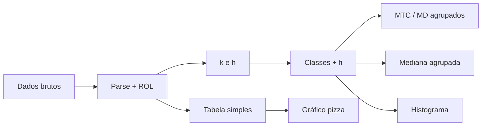

<div align="center">

```
   ╔═══════════════════════════════════════════════════════════╗
   ║  Σ  ·  CEPRO  ·  FATEC — Estatística Aplicada  ·  PROTÓTIPO  ║
   ╚═══════════════════════════════════════════════════════════╝
```


# ✨ Calculadora Estatística Profissional

**Protótipo didático** para análise descritiva — ROL, frequências, MTC, dispersão, mediana agrupada e gráficos — em **JavaScript puro** no navegador.

[](https://developer.mozilla.org/pt-BR/docs/Web/HTML)
[](https://developer.mozilla.org/pt-BR/docs/Web/JavaScript)
[](https://www.chartjs.org/)
[]()

[🚀 Como abrir](#-como-abrir-em-10-segundos) · [📖 Tour interativo](#-tour-interativo-clique-para-expandir) · [📁 Arquivos](#-mapa-do-projeto) · [🐍 Python opcional](#-versão-python-streamlit-opcional)

</div>

---

## 🎯 O que este protótipo faz?

| Área | O que você obtém |
|:---:|:---|
| 📥 **Entrada** | Cole números com **vírgula** ou **espaço**; análise em **tempo real** (ou só ao clicar). |
| 📊 **ROL & n** | Lista ordenada e tamanho da amostra. |
| 📋 **Tabelas** | Frequência **simples** (discreta) e **por classes** (contínua): \(f_i\), \(f_r\%\), \(F_i\), \(F_r\%\), \(x_i\), \(\Sigma f_i x_i\), \(\Sigma f_i x_i^2\). |
| 📐 **Classes (Aula II)** | \(k\) por **Sturges** ou **\(\sqrt{n}\)**; \(h = AT/k\) com ou sem **ceil**. |
| 📈 **MTC** | Média (incl. **agrupada** quando há classes), **mediana**, **moda** (amodal / uni / multimodal). |
| 📉 **MD & Aula IV** | AT, **variância** e **desvio** **amostral (n−1)** ou **populacional (n)** nos dados agrupados; **mediana agrupada** com passo a passo. |
| 🎨 **Gráficos** | **Histograma** e **pizza** (Chart.js). |
| 🌙 **UI** | Tema escuro, painéis e tipografia mono para “cara de prova”. |

---

## ⚡ Como abrir em 10 segundos

1. Baixe ou clone esta pasta.
2. Dê **duplo clique** em **`index.html`** *ou* abra com **Live Server** no VS Code / Cursor.
3. Pronto — funciona **sem build** e **sem Node**.

> **Obs.:** Os gráficos usam **Chart.js via CDN**. Para uso **100% offline**, baixe o `chart.umd.min.js` e aponte o `<script>` no `index.html` para o arquivo local.

---

## 🗺️ Mapa do projeto

| Arquivo | Papel |
|:---|:---|
| `index.html` | Estrutura da página, meta, favicon (`logo.png`) e *shell* da interface. |
| `styles.css` | Visual dark, grid responsivo, painéis e componentes. |
| `app.js` | Toda a lógica: parse, tabelas, MTC, variância agrupada, mediana agrupada, Chart.js. |
| `logo.png` | Identidade visual **CEPRO / Fatec — Estatística Aplicada** (cabeçalho + ícone da aba). |
| `pyton/` | Variante **Streamlit + NumPy/Pandas** (opcional). |
| `requirements.txt` | Dependências da versão Python. |

---

## 📖 Tour interativo *(clique para expandir)*

<details>
<summary><b>🧮 1) Entrada de dados</b></summary>

<br>

- Aceita formatos como: `10 12 13` ou `10, 12, 13`.
- Mínimo **2 valores** numéricos.
- Modo **tempo real**: atualiza com pequeno atraso enquanto você digita.
- Botões **Analisar** e **Limpar**.

</details>

<details>
<summary><b>⚙️ 2) Configurações “de prova”</b></summary>

<br>

| Opção | Descrição |
|:---|:---|
| **k** | Sturges \(k = 1 + 3{,}3\log_{10}(n)\) ou \(k = \lceil\sqrt{n}\rceil\). |
| **h** | \(h = AT/k\) com decimais ou arredondamento **ceil**. |
| **Variância** | Amostral (**n−1**) ou populacional (**n**) nos cálculos **agrupados**. |
| **Decimais** | 0 a 6 casas na exibição. |

</details>

<details>
<summary><b>📚 3) O que aparece na tela</b></summary>

<br>

- **KPIs**: ROL, n, MTC, AT, variância e desvio.
- **Tabela discreta**: \(x_i\), \(f_i\), \(f_r\%\), \(F_i\), \(F_r\%\).
- **Tabela de classes**: limites, pontos médios, frequências e totais.
- **Memória de cálculo**: somatórios \(\Sigma f_i x_i\), \(\Sigma f_i x_i^2\), média agrupada.
- **Mediana agrupada**: classe mediana, fórmula \(Me = l_i + \frac{(n/2 - F_{ant})}{f_{me}} \cdot h\) e substituição numérica.

</details>

<details>
<summary><b>📐 4) Fórmulas em destaque (resumo)</b></summary>

<br>

- **Média agrupada:** \(\bar{x} = \dfrac{\sum f_i x_i}{n}\)
- **Variância (base agrupada):** \(\dfrac{\sum f_i x_i^2}{n} - \bar{x}^2\) com fator amostral/populacional conforme seleção.
- **Sturges:** \(k = 1 + 3{,}3\log_{10}(n)\) (arredondada para cima na implementação).

*Consulte o material da disciplina para convenções exatas da sua turma.*

</details>

---

## 🐍 Versão Python (Streamlit) — *opcional*

<details>
<summary><b>Clique para ver como rodar o app em <code>pyton/</code></b></summary>

<br>

```bash
python -m venv .venv
.venv\Scripts\activate
pip install -r requirements.txt
cd pyton
streamlit run app.py
```

A interface e os cálculos estão em `pyton/app.py` e `pyton/calculos.py` (NumPy / Pandas / Matplotlib).  
*Use `cd pyton` para o Python encontrar `calculos.py` nos imports.*

</details>

---

## 🧭 Fluxo mental *(diagrama)*



> *Se o preview do Mermaid não renderizar no seu visualizador, copie o bloco para [mermaid.live](https://mermaid.live).*

---

## ✅ Checklist rápido antes da entrega

- [ ] `logo.png` está na mesma pasta que `index.html`.
- [ ] Testei com pelo menos **2** números e com um conjunto **maior**.
- [ ] Testei **Sturges** vs **√n** e **ceil** vs **decimais** em **h**.
- [ ] Conferi **variância amostral** vs **populacional** nos dados agrupados.
- [ ] Se for apresentar **offline**, conferi o **Chart.js** local ou internet.

---

## 📜 Créditos & uso da marca

Identidade **CEPRO / FATEC — Estatística Aplicada** usada no contexto acadêmico do projeto. Para divulgação externa, alinhe com a coordenação ou responsáveis pela marca institucional.

---

<div align="center">

**Feito com ☕, Σ e muitos `console.log` evitados.**

*Protótipo — Estatística Aplicada · FATEC*

</div>
